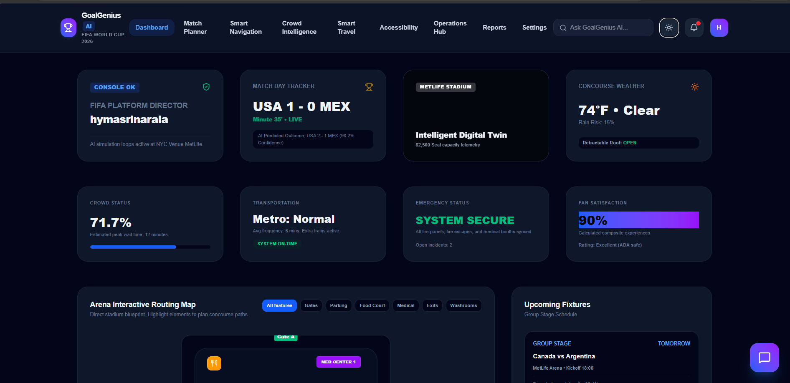
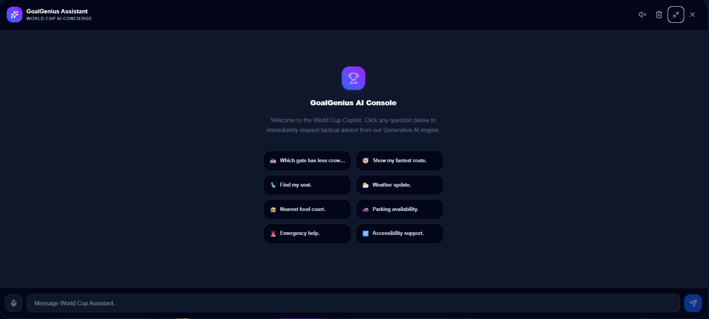
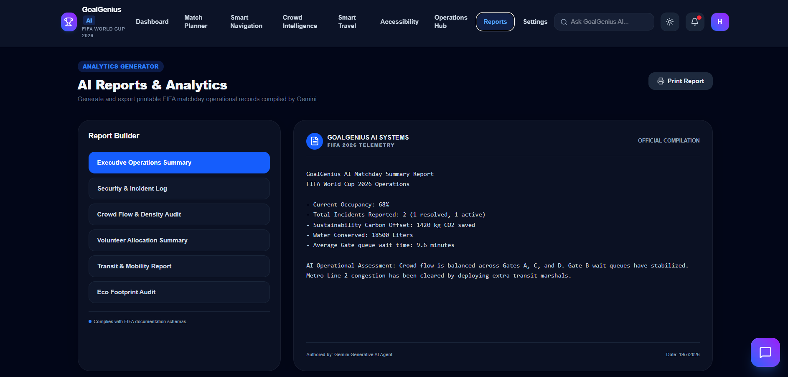
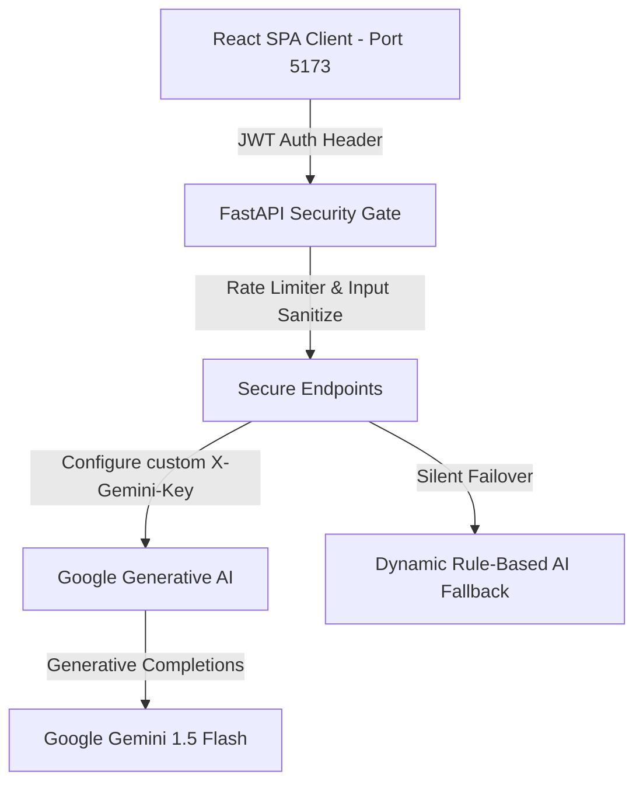

# 🏟️ GoalGenius AI

GoalGenius AI is a next-generation, AI-powered Smart Stadium Operations and Fan Experience Platform custom-engineered for the FIFA World Cup 2026. Built with a FastAPI backend and a React Single Page Application (SPA), the console coordinates real-time crowd safety metrics, multimodal transit systems, high-contrast accessibility tools, and Generative AI incident responders to ensure secure and seamless matchdays.

---

## Badges


---

## Table of Contents

- [Overview](#%EF%B8%8F-goalgenius-ai)
- [Features](#-features)
- [Screenshots](#-screenshots)
- [System Architecture](#%EF%B8%8F-system-architecture)
- [Tech Stack](#-tech-stack)
- [Project Structure](#-project-structure)
- [Installation](#-installation)
- [Running the Application](#-running-the-application)
- [Automated Testing](#-automated-testing)
- [Security Matrix](#-security-matrix)
- [AI Intelligence Core](#-ai-intelligence-core)
- [License](#-license)

---

## 🌟 Features

*   **🛡️ AI Stadium Copilot**: A centralized operations command board displaying live seat occupancy, current weather conditions, retractable roof updates, active staff rosters, and an interactive AI terminal for direct operator overrides.
*   **♻️ Sustainability Dashboard**: Interactive charts tracking carbon savings, water conservation indices, and solid waste category audits (recyclables, organics, and landfill sorting) along with generative carbon-reduction guides.
*   **🗺️ Interactive Stadium Map**: Highly responsive CSS/SVG-drawn arena layout mapping gates A-F, parking zones, medical bays, emergency exits, and ADA washrooms, paired with live AI congestion path indicators.
*   **🤖 AI ChatGPT-Style Concierge**: Translates operational commands and fan queries on seat finding, gate wait-times, and weather. Features speech recognition, prompt recommendations, and conversation history.
*   **🚄 Multimodal Travel Copilot**: Plans and checks routing choices across metro networks, shuttles, and walking avenues using dynamic safety risk scores and dynamic carbon comparison graphs.
*   **🩺 Incident Operations Center**: Coordinates incident reporting, parses telemetry logs, and triggers volunteer dispatch instructions for medical or facility emergencies.
*   **♿ Accessibility Portal**: Equips disabled guests with high-contrast templates, auditory status broadcasts, and physical chaperone request alarms.
*   **📋 Volunteer Allocation**: Displays dynamic roster counts (active vs standby), rosters, and AI task lists matching incident workloads.

---

## 📸 Screenshots

### Login Screen


### Dashboard


### Interactive Stadium Map


### AI Chatbot


### Reports


---

## 🏗️ System Architecture

GoalGenius AI follows a modern, decoupled client-server architecture:



*   **Frontend**: A responsive Single Page Application built on React 19, styled with Tailwind CSS v4, and compiled using Vite. It enforces strict TypeScript typings and utilizes pathless layout layouts for secure routing.
*   **Backend**: An asynchronous FastAPI web service. Serves JSON API schemas, validates payloads with Pydantic, applies middleware security controls, and hosts compiled production client assets.
*   **AI Engine**: Server-side Gemini 1.5 API completions. Requests route securely through the backend, keeping API credentials shielded from client inspections.
*   **Authentication**: JWT (JSON Web Token) HMAC-SHA256 signature verification. Layout guards restrict access to authenticated clients.

---

## 💻 Tech Stack

| Category | Technology |
| :--- | :--- |
| **Frontend** | React 19, Vite, Tailwind CSS v4, Recharts, Framer Motion |
| **Backend** | FastAPI, Uvicorn, Pydantic, PyJWT |
| **Languages** | TypeScript, Python 3.12 |
| **AI Integration** | Google Gemini 1.5 Flash (via `google-generativeai`) |
| **Authentication** | JSON Web Token (JWT HS256) Security Bearer Contexts |
| **Testing** | Vitest, React Testing Library, Pytest, JSDOM |
| **CI/CD** | GitHub Actions |

---

## 📂 Project Structure

```text
GoalGenius-AI/
├── .github/
│   └── workflows/
│       └── ci.yml             # DevOps Actions Workflow
├── backend/
│   ├── app/
│   │   ├── __init__.py
│   │   └── main.py            # FastAPI entrypoint, middlewares, secure routes
│   ├── tests/
│   │   └── test_main.py       # Pytest backend endpoint test suites with JWT setup
│   ├── .env                   # Environment config template
│   └── requirements.txt       # Python dependencies (includes pyjwt)
├── frontend/
│   ├── src/
│   │   ├── components/        # Layout, Navbar, StadiumMap, AIChatBot
│   │   ├── context/           # Theme, Language, Auth, Simulation Contexts
│   │   ├── hooks/             # useGemini API caller injecting auth headers
│   │   ├── pages/             # Dashboard, Login, Copilot, Sustainability, Travel
│   │   └── test/              # Vitest suite (Login, Dashboard, Chatbot, Copilot, Eco)
│   ├── vite.config.ts         # Vite configuration (Vitest config)
│   └── package.json           # Node dependencies
└── README.md                  # Project root documentation
```

---

## 📥 Installation

Ensure Python 3.12+ and Node.js 20+ are installed.

### 1. Backend Setup
```bash
cd backend
pip install -r requirements.txt
pip install pytest httpx python-dotenv pyjwt
```
Create a `.env` file in the `backend/` directory:
```bash
GEMINI_API_KEY="your_api_key_here"
JWT_SECRET_KEY="your_secure_hash_secret_key"
```

### 2. Frontend Setup
```bash
cd ../frontend
npm install
```

---

## 🏃 Running the Application

### Start Backend Service
```bash
cd backend
python -m uvicorn app.main:app --reload --port 8000
```
*The FastAPI dashboard docs will be live at `http://localhost:8000/docs`.*

### Start Frontend Server
```bash
cd frontend
npm run dev
```
*Open `http://localhost:5173/` in your browser to view the client panel.*

---

## 🔬 Automated Testing

GoalGenius AI includes automated test verification.

### Frontend Component Tests (Vitest)
```bash
cd frontend
npx vitest run
```

### Backend API Tests (Pytest)
```bash
cd backend
python -m pytest
```

---

## 🔒 Security Matrix

*   **JWT Secure Lifecycle**: Session parameters encoded using HMAC-SHA256 signature algorithm. Clients transmit credentials via secure `Authorization: Bearer <JWT>` header schemas.
*   **Input Sanitization**: High-security server-side HTML character escaping shields endpoints from potential Cross-Site Scripting (XSS) and injection vectors.
*   **Security Middlewares**: FastAPI applies rate-limit restrictions (150 requests/min per IP) and strict security headers (Strict-Transport-Security, X-XSS-Protection, X-Frame-Options: DENY, Content-Security-Policy).
*   **Data Validation**: Enforces structured Pydantic models with explicit length and value constraints for incoming POST bodies.

---

## 🧠 AI Intelligence Core

*   **Dynamic Prompts**: Telemetry parameters (occupancy, delay indexes, weather states, incident category) are compiled into prompt templates.
*   **Dynamic Custom Credentials**: Secure `X-Gemini-Key` header mapping enables operators to configure their own developer keys directly in Settings for real-time generative responses.
*   **Rule-Based Failover Engine**: If API keys are missing or offline, a complex local rule-based intelligence engine generates tailored recommendations based on prompt context to guarantee zero static/hardcoded AI strings.

---

## 👤 Author

*   **Name**: [Hyma Sri Narala]
