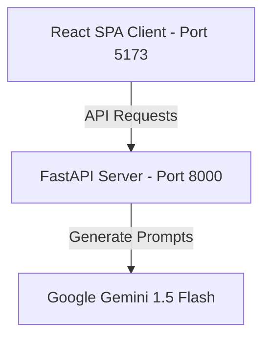

# 🏟️ GoalGenius AI

GoalGenius AI is a next-generation, AI-powered Smart Stadium Operations and Fan Experience Platform custom-engineered for the FIFA World Cup 2026. Built with a FastAPI backend and a React Single Page Application (SPA), the console coordinates real-time crowd safety metrics, multimodal transit systems, high-contrast accessibility tools, and Generative AI incident responders to ensure secure and seamless matchdays.

---

## Badges


---

## Table of Contents

- [Overview](#%EF%B8%8F-goalgenius-ai)
- [Features](#-features)
- [Screenshots](#-screenshots)
- [System Architecture](#%EF%B8%8F-system-architecture)
- [Tech Stack](#-tech-stack)
- [Project Structure](#-project-structure)
- [Installation](#-installation)
- [Running the Application](#-running-the-application)
- [Automated Testing](#-automated-testing)
- [Security](#-security)
- [DevOps](#-devops)
- [AI Features](#-ai-features)
- [Future Enhancements](#-future-enhancements)
- [License](#-license)
- [Author](#-author)

---

## 🌟 Features

*   **🗺️ Interactive Stadium Map**: Highly responsive CSS/SVG-drawn arena layout mapping gates A-F, parking zones, medical bays, emergency exits, and ADA washrooms, paired with live AI congestion path indicators.
*   **🤖 AI ChatGPT-Style Concierge**: Translates operational commands and fan queries on seat finding, gate wait-times, and weather. Features speech recognition, prompt recommendations, and conversation history.
*   **🚄 Multimodal Travel Copilot**: Plans and checks routing choices across metro networks, shuttles, and walking avenues using dynamic safety risk scores.
*   **🩺 Incident Operations Center**: Coordinates incident reporting, parses telemetry logs, and triggers volunteer dispatch instructions for medical or facility emergencies.
*   **♿ Accessibility Portal**: Equips disabled guests with high-contrast templates, auditory status broadcasts, and physical chaperone request alarms.

---

## 📸 Screenshots

*(Images can be embedded below once uploaded to your repository)*

### Login Screen


### Dashboard


### Interactive Stadium Map


### AI Chatbot


### Reports


---

## 🏗️ System Architecture

GoalGenius AI follows a modern, decoupled client-server architecture:



*   **Frontend**: A responsive Single Page Application built on React, styled with Tailwind CSS, and compiled using Vite. It enforces strict TypeScript typings and utilizes pathless layout layouts for secure routing.
*   **Backend**: An asynchronous FastAPI web service. Serves JSON API schemas, validates payloads with Pydantic, applies middleware security controls, and hosts compiled production client assets.
*   **AI Engine**: Server-side Gemini 1.5 API completions. Requests route securely through the backend, keeping API credentials shielded from client inspections.
*   **Authentication**: Session-based cookie verification and layout route guards.

---

## 💻 Tech Stack

| Category | Technology |
| :--- | :--- |
| **Frontend** | React 19, Vite, Tailwind CSS, Recharts |
| **Backend** | FastAPI, Uvicorn, Pydantic |
| **Languages** | TypeScript, Python 3.12 |
| **AI Integration** | Google Gemini 1.5 Flash (via `google-generativeai`) |
| **Authentication** | Custom Auth Context, Protected Router Guards |
| **Testing** | Vitest, React Testing Library, Pytest, JSDOM |
| **CI/CD** | GitHub Actions |

---

## 📂 Project Structure

```text
GoalGenius-AI/
├── .github/
│   └── workflows/
│       └── ci.yml             # DevOps Actions Workflow
├── backend/
│   ├── app/
│   │   ├── __init__.py
│   │   └── main.py            # FastAPI main server entry point
│   ├── tests/
│   │   └── test_main.py       # Pytest backend endpoint test suites
│   ├── .env                   # Environment config template
│   └── requirements.txt       # Python dependencies
├── frontend/
│   ├── src/
│   │   ├── components/        # Layout, Navbar, StadiumMap, AIChatBot
│   │   ├── context/           # Theme, Language, Auth, Simulation Contexts
│   │   ├── hooks/             # useGemini API caller
│   │   ├── pages/             # Dashboard, Login, Travel, Operations Center
│   │   └── test/              # Vitest suite (Login, Dashboard, Chatbot)
│   ├── vite.config.ts         # Vite configuration (Vitest config)
│   └── package.json           # Node dependencies
└── README.md                  # Project root documentation
```

---

## 📥 Installation

Ensure Python 3.12+ and Node.js 20+ are installed.

### 1. Backend Setup
```bash
cd backend
pip install -r requirements.txt
pip install pytest httpx python-dotenv
```
Create a `.env` file in the `backend/` directory:
```bash
GEMINI_API_KEY="your_api_key_here"
```

### 2. Frontend Setup
```bash
cd ../frontend
npm install
```

---

## 🏃 Running the Application

### Start Backend Service
```bash
cd backend
python -m uvicorn app.main:app --reload --port 8000
```
*The FastAPI dashboard docs will be live at `http://localhost:8000/docs`.*

### Start Frontend Server
```bash
cd frontend
npm run dev
```
*Open `http://localhost:5173/` in your browser to view the client panel.*

---

## 🔬 Automated Testing

GoalGenius AI includes automated test verification.

### Frontend Component Tests (Vitest)
```bash
cd frontend
npx vitest run
```

### Backend API Tests (Pytest)
```bash
cd backend
python -m pytest
```

---

## 🔒 Security

*   **Server-Side Credentials**: Gemini API keys are loaded on the server and are never exposed in JavaScript bundles.
*   **Security Middlewares**: FastAPI applies rate-limit restrictions and secure headers (Content-Security-Policy, HSTS, XSS protections, X-Frame-Options).
*   **Data Validation**: Enforces structured Pydantic models for incoming POST bodies.

---

## ⚙️ DevOps

A **GitHub Actions** CI pipeline (`ci.yml`) triggers on pull requests to run:
1.  **Backend Pytest Suite** validation checks.
2.  **Frontend Vitest Component** test verification.
3.  **Vite Build compilation** processes.

---

## 🧠 AI Features

*   **AI Crowd Intelligence**: Renders estimated gate congestion metrics and balances queue dispatches.
*   **AI Incident Analysis**: Parses telemetry inputs to estimate emergency response squads and logs.
*   **AI Travel Copilot**: Modulates navigation suggestions based on rain and transit delays.
*   **AI Voice Chatbot**: Features real-time voice synthesis and speech-to-text queries.
*   **Multilingual Support**: Supports English, Spanish, French, Portuguese, Hindi, Telugu, and Arabic.

---

## 🔮 Future Enhancements

*   **IoT Sensors Integration**: Live crowd cameras and telemetry.
*   **FIFA Match APIs**: Real-time score boards and schedules.
*   **Predictive Congestion Models**: Forecasting bottleneck density.
*   **Mobile App**: Companion app for fans.

---

## 📄 License

This project is licensed under the MIT License - see the [LICENSE](LICENSE) file for details.

---

## 👤 Author

*   **Name**: [Your Name / Team Name]
*   **LinkedIn**: [LinkedIn Profile Link]
*   **GitHub**: [@YourGitHubUsername](https://github.com/YourGitHubUsername)
*   **Email**: director@worldcup2026.org
